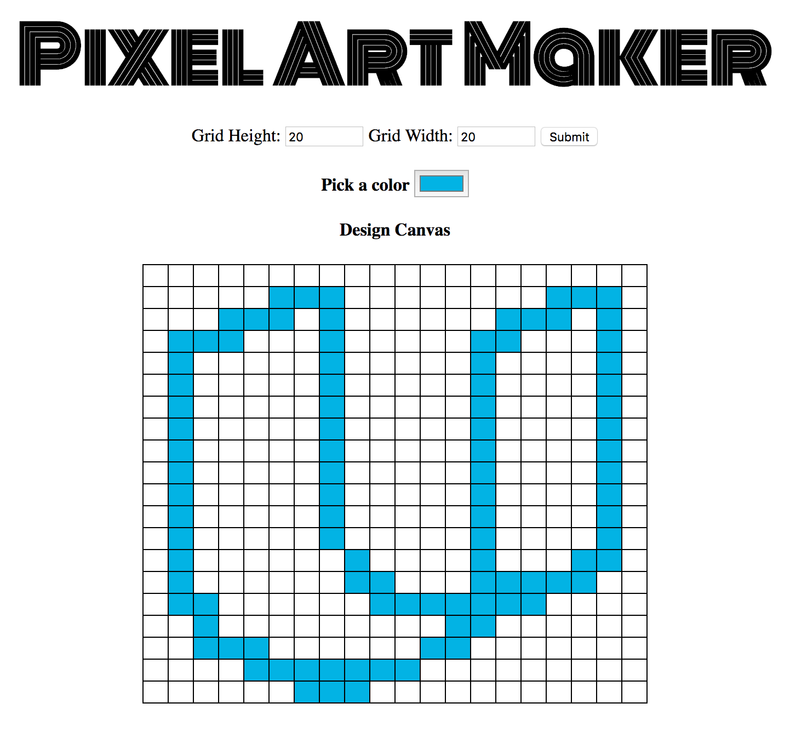

# Pixel Art Maker

* This is a single-page web app that allows users to draw pixel art on a customizable canvas

* Open and view the Project using the `.zip` file provided or at my [Github Repository](https://github.com/madhur-taneja/Pixel-Art-Maker).

* The project is also hosted on [Github](https://madhur-taneja.github.io/Pixel-Art-Maker/).

## Table of Contents
- [Getting Started](#getting-started)
	- [Tools Required](#tools-required)
	- [Running the App](#running-the-app)
- [Features](#features)
- [References](#references)

## Getting Started

* Your primary task is to implement the makeGrid() function, that dynamically creates a grid that the user can interact with.

* The starter code can be found in [this](https://github.com/udacity/project-pixel-art-maker-starter) repo provided by Udacity.

* This is how the canvas will look:
  

### Tools required:

* [jQuery](https://code.jquery.com/jquery-3.2.1.min.js) (Javascript Library) for easier coding of javascript.
* [JS Beautifier](http://www.freeformatter.com/javascript-beautifier.html) to Beautify JS.
* [Online Markdown Editor](http://dillinger.io/) to test `README.md`.

### Running the App:

Open the project through the `.zip` file provided and extract the files. Then, Open `index.html`.

## Features:

* Input value of rows and columns and press submit.
* Add or Remove Rows and Columns with specialized buttons.
* Add colors to cells of the grid.
* Reset the Grid

## References

No external resources were required for this project